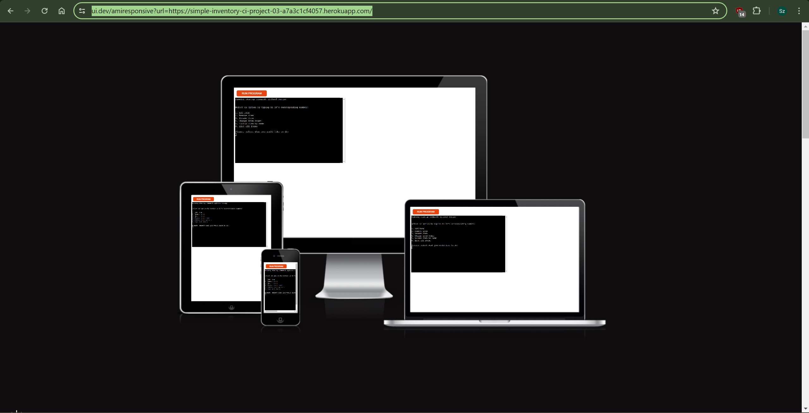
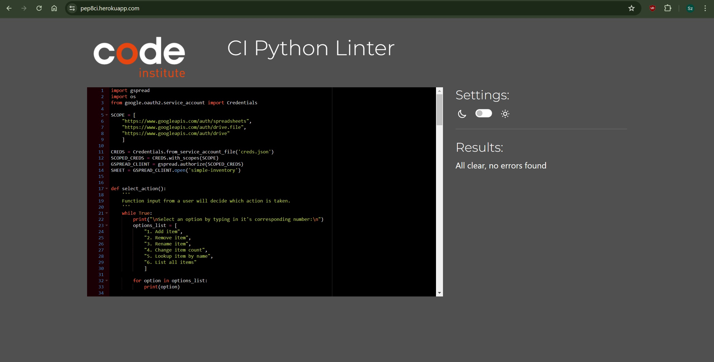

# **_Simple-Inventory_**

Simple-Inventory is a tool to do basic management of data. Data is stored in an external GoogleSheets file. This tool allows users to add, remove, modify and list elements in the spreadsheet formed as a list. Therefore it can be used both as a list of items (i.e. shopping list) or with modification as an inventory system for a game. 

You can find the deployed program at:
<a href="https://simple-inventory-ci-project-03-a7a3c1cf4057.herokuapp.com/" target="_blank" rel="noopener">Simple-Inventory</a>
And here you can find a spreadsheet for this app (available to all with the link):
<a href="https://docs.google.com/spreadsheets/d/1W8bkRF3eIWU2V4iHxtK1wWGB3qZX73VKOhc29OEANDo/edit?usp=sharing" target="_blank" rel="noopener">Simple-Inventory Spreadsheet</a>

# Contents

* [**User Experience UX**](<#User-Experience-UX>)
    * [User Expectations](<#User-Expectations>)
    * [Wireframes](<#Wireframes>)
    * [Design Choices](<#Design-Choices>)
* [**Features**](<#Features>)
    * [**Main Menu**](<#Main-Menu>)
    * [**Actions and Validation**](<#Actions-and-Validation>)
        * [**Add Item**](<#Add-Item>)
        * [**Remove item**](<#Remove-Item>)
        * [**Rename Item**](<#Rename-Item>)
        * [**Change Item Count**](<#Change-Item-Count>)
        * [**Lookup Item by Name**](<#Lookup-Item-by-Name>)    
        * [**List all Items**](<#List-all-Items>)
    * [**Future Features**](<#Future-Features>)
* [**Technologies Used**](<#technologies-used>)
* [**Testing**](<#testing>)
* [**Deployment**](<#deployment>)
* [**Credits**](<#credits>)
* [**Acknowledgments**](<#acknowledgments>)

# User Experience (UX)

## User Expectations

* Easy-to-understand descriptions of actions that users can take
* Modifying the data contained in the file with the use of a Simple-Inventory:
    * Adding new elements
    * Removing existing elements
    * Renaming existing elements
    * Changing the value of the count of the elements
    * Looking up specific elements
    * Listing all elements within the Simple-Inventory
* Input data validation to make sure that correct data is displayed, modified and recorded
* Display of actions being taken to ensure that user know the program is running and on track

[Back to top](<#contents>)

## Wireframes

The wireframes for Simple-Inventory were produced in [Lucid](https://lucid.app/). Frames depict the first draft of the program concept. Core concepts remained the same throughout the development. Minor changes occurred during development and were implemented on "as needed" basis.

[Wireframes made with Lucid](assets/image/readme-image/Simple-Inventory_wireframes.jpg)

[Back to top](<#contents>)

## Program structure

The program starts in "the main menu" with simple instructions to input a number corresponding to the action users want to take. From there it proceeds to guide the users with on-screen prints that inform users both of what the program is doing and what is the result of their inputs. It includes the display of validation errors that instruct users to correct their input. After action is carried out successfully program returns to "main menu" to allow users to take another action.

[Back to top](<#contents>)

## Design Choices

### The program can externally edit a list of items. Which can be repurposed for many applications. Therefore the program is as simple in its goals as possible. The programs aim to:
    
* Be descriptive and easy to read
* De-clutter the screen from previous actions as it carries out new ones
* Be adaptable for future uses (inventory systems for games, shopping lists, lists of employees etc.)

[Back to top](<#contents>)

# Features
   
## Main Menu

* Simple message instructing users to select an action from the list below.
* The list is numbered and actions on it can be selected by inputting their corresponding number into the terminal/console
* At the bottom program allows for input which is indicated by a simple message
   
[Back to top](<#contents>)

## Actions and Validation

* When users select their action onscreen descriptions guide them through any steps necessary to carry it out.

### Add Item:
* Allows users to create completely new items on the list. To carry out this action the user must:
    * Enter a name for the item:
        - name has to be unique (not yet present on the list)
        - any character can be used to create it
    * Enter the count of an item they wish to add:
        - this has to be integers/whole numbers but can be adapted in the future to floats
* Afterwards program displays information that the item was added and it is the current count

[Back to top](<#contents>)

### Remove Item:
* Allows users to remove items that are already on the list. It removes the whole row of data. To carry it out users must:
    * Enter the name of the item:
        - Item must be present on the list otherwise "Item not found" message will be displayed
        - The item name is case sensitive, meaning it matters if it is spelled Tomato or tomato or TOMATO etc.
* Afterwards program displays information that the item was removed.

[Back to top](<#contents>)

### Rename Item:
* Allows users to rename items that are already on the list. It modifies only the cell containing the name itself. To carry it out users must:
    * Enter the name of the item they wish to change:
        - Item must be present on the list otherwise "Item not found" message will be displayed
        - The item name is case sensitive, meaning it matters if it is spelled Tomato or tomato or TOMATO etc.
        - If the item was found on the list option to enter a new name will be available
        - Any characters can be used for the new name
* When the new name is provided a message will display the original name and what it was changed to. 

[Back to top](<#contents>)

### Change Item Count:
* Similarly to "Rename Item" "Change Item Count" allows to change only the cell containing the count of item specified. To carry it out users must:
    * Enter the name of the item they wish to change:
        - Item must be present on the list otherwise "Item not found" message will be displayed
        - The item name is case sensitive, meaning it matters if it is spelled Tomato or tomato or TOMATO etc.
        - If the item was found on the list option to enter a new count will be available
        - Only numbers will be accepted for the new count
* When the new count is provided a message will display the item name and its new count.

[Back to top](<#contents>)

### Lookup Item by Name:
* Allows users to check if the item they input is already on the list. To carry it out users must:
    * Enter the name they wish to search for:
        - Item must be present on the list otherwise "Item not found" message will be displayed
        - The item name is case sensitive, meaning it matters if it is spelled Tomato or tomato or TOMATO etc.
* If the item was found message will be displayed containing: item name, item count and item position in the spreadsheet

[Back to top](<#contents>)

### List All Items:
* Allows users to list all items in the spreadsheet (including headings for context). Does not require any additional inputs. The option can be used to check changes made with the program without checking the spreadsheet itself, lowering the need to switch between them

[Back to top](<#contents>)

## Future Features 
* The program can easily be repurposed to include classes of items and used to create, for example, a loot table for an RPG game, or simply an inventory system for it
* Currently, users can in theory add multiple entries of the same item if they use lower/upper case. I.e. Tomato/TOMATO/tomato/ToMaTo. For now, this will remain in the program as it is low priority and users can change the formatting of their entries with the rename option
* If needed the option to use integers in the Item name can be blocked, but for now, I will allow it, as it adds to the flexibility
* Depending on the user feedback more descriptions can be added to further clarify the meaning behind actions taken

[Back to top](<#contents>)

# Technologies Used

* [Python](https://www.python.org/) - the programming language used to create the program
* [Lucid](https://lucid.app/) - concept wireframes
* [Visual Studio Code](https://code.visualstudio.com/) - IDE used to develop, edit, commit and push the code to GitHub
* [Github](https://github.com/) - used as a repository for the project and to deploy a public version of the Simple-Inventory
* [Heroku](https://dashboard.heroku.com/) - used to deploy the app and use mock terminal for testing and evaluation of the project
* [GoogleSheets](https://www.google.com/sheets/about/) - used to store data in the spreadsheet

[Back to top](<#contents>)

# Testing

I tested every feature as I was coding it. I also asked my peers and close ones to test it and try to break the program. In testing I used print statements as a main method of troubleshooting. The program is simple enough that I could do with this amount of testing to be confident it meets my goals.

The code was tested using Code Institute's Python Linter and returned no errors after corrections. The code was retested after that to ensure that no functionality was broken.

[Back to top](<#contents>)

# Deployment

This project was deployed using Code Institute's mock terminal for Heroku.

* Steps for deployment:
    * Fork or clone this repository:
    <a href="https://github.com/SimonCzEdu/simple-inventory.git" target="_blank" rel="noopener">Simple-Inventory</a>
    * Create Heroku app using that repository
    * Set the buildbacks to Python and NodeJs in that order
    * Link the Heroku app to the repository
    * Click on Deploy

[Back to top](<#contents>)

# Credits
## Inspirations:

* finding specific data and updating/deleting it:
	* https://docs.gspread.org/en/latest/user-guide.html#deleting-a-worksheet
	* https://stackoverflow.com/questions/61213417/delete-remove-column-in-google-sheet-over-gspread-python-like-sheet-delete-row
* clearing terminal with a function:
	* https://www.geeksforgeeks.org/clear-screen-python/

* DISCLAIMER: This project is based on "the Love Sandwiches" project by Code Institute. It is used mainly as a base and set up. This is my first project using Python and I could not do this on my own without help and guidance of the Code Institute.

[Back to top](<#contents>)

# Acknowledgments

The site was completed as a Portfolio Project 3 piece for the Full Stack Software Developer (e-Commerce) Diploma at the [Code Institute](https://codeinstitute.net/). As such I would like to thank my mentor [Precious Ijege](https://www.linkedin.com/in/precious-ijege-908a00168/), the Slack community, and all at the Code Institute for their help and support.

Simple-Inventory is my first step on the road to learning Python. The game I wish I can expand and flesh out in the future. I would like to thank Code Institute for this opportunity.

I also would like to thank my wife Marta Furman for her help with the project and support. She tested the app, provided invaluable insight and inspired me every step.

Szymon Czapiewski 2024.

[Back to top](<#contents>)